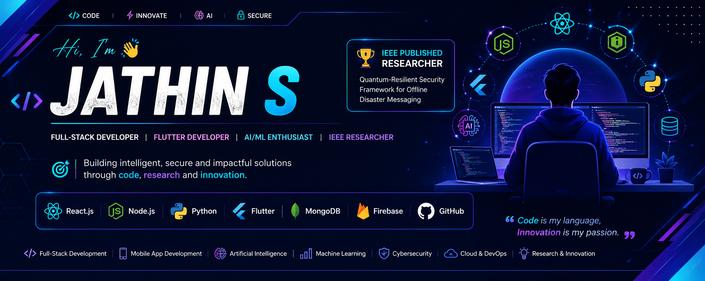

  

# Hi 👋, I'm Jathin S

### 🚀 MCA Graduate | Full-Stack Developer | Flutter Developer | AI/ML Enthusiast

---

## 👨‍💻 About Me

🎓 Integrated MCA Graduate from Amrita School of Arts and Sciences, Mysuru

🔬 IEEE Published Researcher

💻 Passionate about:
- Full Stack Development
- Flutter App Development
- Machine Learning
- Cybersecurity
- Artificial Intelligence

🌱 Currently learning:
- Advanced Flutter
- Cloud Computing
- AI Applications

---

## 🚀 Tech Stack

### Languages

### Frontend

### Backend

### Mobile

### Database

---

## 🌟 Featured Projects

### 🔐 Quantum Messenger
Secure offline messaging application using Post-Quantum Cryptography.

### 🌿 Cotton Plant Disease Prediction
Hybrid DenseNet121 + ResNet50 model with 96% accuracy.

### 📄 Resume Keyword Analyzer
ATS-based resume optimization system.

### 🤖 AI Counsellor
AI-powered study abroad counselling platform.

### 🛒 ShopLuxe
Serverless MERN E-Commerce Platform.

### 🛡️ Code Risk Analyzer
Static code vulnerability detection tool.

---

## 📊 GitHub Stats

---

## 🔬 Research Publication

📖 IEEE ICMCSI 2026

**Quantum-Resilient, Software-Defined Security Framework for Offline Disaster Messaging: Dynamic Crypto-Agility and Policy-Oriented Trust**

---

## 📫 Connect With Me

- LinkedIn: https://www.linkedin.com/in/jathin-s-71a55225a
- Email: jathin848@gmail.com

---

⭐ Thanks for visiting my profile!
